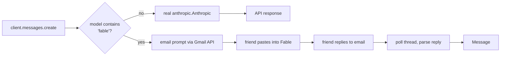

<p align="center">
  
</p>

# fable-meat-proxy 🥩

[](https://github.com/plwp/fable-meat-proxy/actions/workflows/ci.yml)

A drop-in replacement for the Anthropic Python client where **Fable's inference is
performed by a human**.

Every real model passes straight through to the genuine `anthropic.Anthropic` client.
But when you select Fable (`model="claude-fable-5"` — anything containing `"fable"`),
the proxy instead **emails the prompt to your American friend**, blocks while polling
Gmail for their reply, and returns that reply as a normal Anthropic `Message`. A meat
proxy: the model is a person.



## Install

```bash
pip install -e .          # runtime
pip install -e '.[dev]'   # + pytest
```

## Configure

Copy `.env.example` to `.env` and fill it in:

| Variable | Purpose |
| --- | --- |
| `FABLE_FRIEND_EMAIL` | **Required.** Where Fable prompts are sent. |
| `FABLE_GMAIL_CREDENTIALS` | OAuth client secret (Desktop app) from Google Cloud. |
| `FABLE_GMAIL_TOKEN` | Where the minted OAuth token is cached. |
| `FABLE_REPLY_TIMEOUT_BUSINESS_DAYS` | Block this many business days for a reply (default `7`, weekends skipped). |
| `FABLE_REPLY_TIMEOUT_SECONDS` | Optional raw-seconds override of the deadline (tests/demos). |
| `FABLE_POLL_INTERVAL` | Seconds between Gmail polls (default `120`). |
| `ANTHROPIC_API_KEY` | Standard key for the real (non-Fable) passthrough. |

### One-time Gmail auth

1. In Google Cloud Console, enable the **Gmail API** and create an **OAuth client ID**
   of type *Desktop app*. Download it as `credentials.json`.
2. Run the OAuth flow once to mint `token.json`:

   ```bash
   fable-meat-auth
   ```

The scope used is `gmail.modify` (send + read of your own account).

## Use

```python
from fable_meat_proxy import Anthropic

client = Anthropic()  # config + Gmail service resolved from the environment

# Real model: ordinary API call.
client.messages.create(
    model="claude-opus-4-8", max_tokens=1024,
    messages=[{"role": "user", "content": "hi"}],
)

# Fable: emails your friend, blocks until they reply, returns their answer.
msg = client.messages.create(
    model="claude-fable-5", max_tokens=1024,
    messages=[{"role": "user", "content": "Write a haiku about meat."}],
)
print(msg.content[0].text)  # whatever your friend pasted back
```

Async works the same way via `AsyncAnthropic` (blocking Gmail calls run in a thread,
polling uses `asyncio.sleep`):

```python
from fable_meat_proxy import AsyncAnthropic

client = AsyncAnthropic()
msg = await client.messages.create(model="claude-fable-5", max_tokens=1024, messages=[...])
```

Your friend receives a formatted email (system prompt + conversation), pastes it into
Fable, and **replies with Fable's output as the plain-text body**. The text above the
quoted original is taken as the answer.

## How it works

- `client.py` — the wrapping `Anthropic` / `AsyncAnthropic`; routes on the model name,
  delegates everything else (`.models`, `.beta`, `messages.count_tokens`, …) to the real
  client. Fable routing applies to `messages.create` / `messages.stream`.
- `meat.py` — the human backend: format → send → block on reply → build a `Message`.
- `gmail_transport.py` — OAuth, send, and thread polling, with transient-error retries
  (HTTP 429/5xx and network errors) using exponential backoff.
- `timing.py` — business-day deadline arithmetic for the (slow, human) reply timeout.
- `parsing.py` — render the outgoing email; extract the reply (`text/plain`, with an
  HTML fallback) and strip quoted text.
- `errors.py` — `FableMeatError`, `FableReplyTimeout` (also a `TimeoutError`),
  `FableConfigError`.

## Test

```bash
pytest
```

43 tests run **offline** — they mock the Gmail service and the real Anthropic client and
cover routing, sync + async paths, reply parsing (plain/HTML/quote-stripping), polling,
business-day deadlines, transient-error retries, streaming rejection, delegation, config,
and `Message` construction. The Gmail OAuth round-trip itself needs your real credentials.

Logging uses the standard `logging` module under the `fable_meat_proxy` logger (no
handlers are installed by the library — configure your own to see send/poll/reply events).

## Caveats

- **Latency is measured in human attention span.** Calls block up to 7 business days by
  default. The process must stay alive for the duration — for long waits, run it under a
  durable worker rather than an interactive script.
- Streaming for Fable raises `NotImplementedError` (a human reply arrives all at once).
- Tool use and token accounting are not modeled for Fable (usage is reported as zero).
  Non-Fable models keep the full real SDK behaviour.
