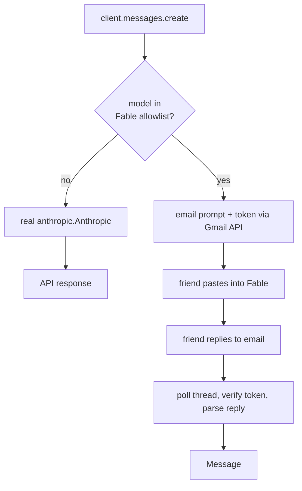

<p align="center">
  
</p>

# fable-meat-proxy 🥩

[](https://github.com/plwp/fable-meat-proxy/actions/workflows/ci.yml)

A drop-in replacement for the Anthropic Python client where **Fable's inference is
performed by a human**.

Every real model passes straight through to the genuine `anthropic.Anthropic` client.
But when you select Fable (`model="claude-fable-5"`, an exact allowlist — see
`FABLE_MODELS`), the proxy instead **emails the prompt to your American friend**, blocks
while polling Gmail for their reply, and returns that reply as a normal Anthropic
`Message`. A meat proxy: the model is a person.

The reply is authenticated: every prompt carries an unguessable token, and a reply is
accepted only if it proves it received that email — a forged `From:` header is not
enough (see [Security](#security)).



## Install

```bash
pip install -e .          # runtime
pip install -e '.[dev]'   # + pytest
```

## Configure

Copy `.env.example` to `.env` and fill it in:

| Variable | Purpose |
| --- | --- |
| `FABLE_FRIEND_EMAIL` | **Required.** Where Fable prompts are sent. |
| `FABLE_GMAIL_CREDENTIALS` | OAuth client secret (Desktop app) from Google Cloud. |
| `FABLE_GMAIL_TOKEN` | Where the minted OAuth token is cached. |
| `FABLE_REPLY_TIMEOUT_BUSINESS_DAYS` | Block this many business days for a reply (default `7`, weekends skipped). |
| `FABLE_REPLY_TIMEOUT_SECONDS` | Optional raw-seconds override of the deadline (tests/demos). |
| `FABLE_POLL_INTERVAL` | Seconds between Gmail polls (default `120`; `from_env` floors it at `5`). |
| `FABLE_MODELS` | Comma-separated exact model allowlist routed to the human (default `claude-fable-5`). |
| `ANTHROPIC_API_KEY` | Standard key for the real (non-Fable) passthrough. |

### One-time Gmail auth

1. In Google Cloud Console, enable the **Gmail API** and create an **OAuth client ID**
   of type *Desktop app*. Download it as `credentials.json`.
2. Run the OAuth flow once to mint `token.json`:

   ```bash
   fable-meat-auth
   ```

Least-privilege scopes are requested: `gmail.send` + `gmail.readonly` (send the
prompt, read the reply thread — no modify/label/delete). The minted `token.json`
holds a refresh token, so it's a **secret**: it's written `0600` and gitignored.

## Use

```python
from fable_meat_proxy import Anthropic

client = Anthropic()  # config + Gmail service resolved from the environment

# Real model: ordinary API call.
client.messages.create(
    model="claude-opus-4-8", max_tokens=1024,
    messages=[{"role": "user", "content": "hi"}],
)

# Fable: emails your friend, blocks until they reply, returns their answer.
msg = client.messages.create(
    model="claude-fable-5", max_tokens=1024,
    messages=[{"role": "user", "content": "Write a haiku about meat."}],
)
print(msg.content[0].text)  # whatever your friend pasted back
```

Async works the same way via `AsyncAnthropic` (blocking Gmail calls run in a thread,
polling uses `asyncio.sleep`):

```python
from fable_meat_proxy import AsyncAnthropic

client = AsyncAnthropic()
msg = await client.messages.create(model="claude-fable-5", max_tokens=1024, messages=[...])
```

Your friend receives a formatted email (system prompt + conversation), pastes it into
Fable, and **replies with Fable's output as the plain-text body**. The text above the
quoted original is taken as the answer. They must leave the quoted original (which
carries the verification token) in place.

## Security

Because the "model" is reachable by email, the proxy treats inbound replies as
untrusted:

- **Reply authentication.** Each request embeds an unguessable token (in the body and
  the `Message-ID`). A reply counts only if it echoes that token — via the quoted
  original or the `In-Reply-To`/`References` headers — *and* comes from the configured
  friend's exact address. Spoofing `From:` alone is rejected. (The token only ever
  reaches the friend's inbox, so an attacker who hasn't seen the email can't reproduce
  it.) This is application-layer defence on top of Gmail's own DKIM/DMARC filtering.
- **Exact model routing.** Only models in the `FABLE_MODELS` allowlist take the human
  path. A substring like `not-fable` can't divert a private prompt to email.
- **No Fable bypass.** `stream=…`, `with_raw_response`, `with_streaming_response`, and
  `count_tokens` reject Fable models rather than silently hitting the real API.
- **Reply parsing.** Attachments are ignored when picking the answer body; the HTML
  fallback strips comments and hidden (`display:none`/`visibility:hidden`) text.
- **Secrets.** `token.json` is created `0600` with no create→chmod race, and an
  existing world/group-readable token is tightened before use. Scopes are
  least-privilege (`gmail.send` + `gmail.readonly`).
- **Prompt injection.** The outgoing email marks the conversation as untrusted and
  tells the human not to follow instructions embedded in it.

## How it works

- `client.py` — the wrapping `Anthropic` / `AsyncAnthropic`; routes on an exact model
  allowlist, delegates everything else (`.models`, `.beta`, …) to the real client. Fable
  routing applies to `messages.create` / `messages.stream` / `messages.count_tokens`.
- `meat.py` — the human backend: mint a per-request token → format → send → block on a
  verified reply → build a `Message`.
- `gmail_transport.py` — OAuth (with `0600` token handling), send, thread polling, and
  token-authenticated reply matching, with transient-error retries (HTTP 429/5xx and
  network errors) using exponential backoff.
- `timing.py` — business-day deadline arithmetic for the (slow, human) reply timeout.
- `parsing.py` — render the outgoing email (with the verification token); extract the
  reply (`text/plain`, skipping attachments, with a hardened HTML fallback) and strip
  quoted text.
- `errors.py` — `FableMeatError`, `FableReplyTimeout` (also a `TimeoutError`),
  `FableConfigError`.

## Test

```bash
pytest
```

68 tests run **offline** — they mock the Gmail service and the real Anthropic client and
cover routing (exact allowlist), sync + async paths, reply authentication (token in body
and threading headers, spoof rejection), reply parsing (plain/HTML/quote-stripping,
attachment skipping, hidden-text removal), polling, business-day deadlines,
transient-error retries, streaming/`count_tokens` rejection, secret-file permissions,
delegation, config, and `Message` construction. The Gmail OAuth round-trip itself needs
your real credentials.

Logging uses the standard `logging` module under the `fable_meat_proxy` logger (no
handlers are installed by the library — configure your own to see send/poll/reply events).

## Caveats

- **Latency is measured in human attention span.** Calls block up to 7 business days by
  default. The process must stay alive for the duration — for long waits, run it under a
  durable worker rather than an interactive script.
- Streaming for Fable raises `NotImplementedError` (a human reply arrives all at once);
  `count_tokens` raises `FableMeatError` for Fable models.
- Tool use and token accounting are not modeled for Fable (usage is reported as zero).
  Non-Fable models keep the full real SDK behaviour.
- Reply authentication assumes the friend leaves the quoted original (or proper
  threading headers) intact; a reply that strips both can't be verified and will wait
  until the deadline.
